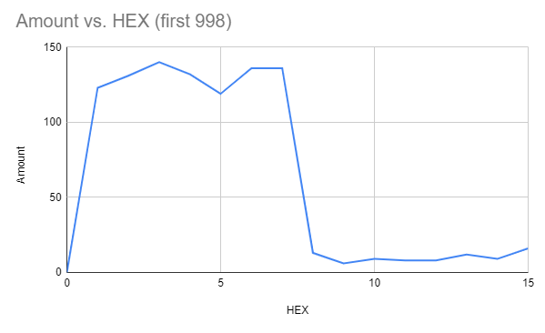
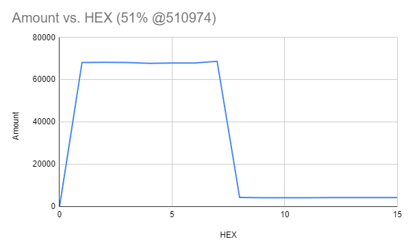
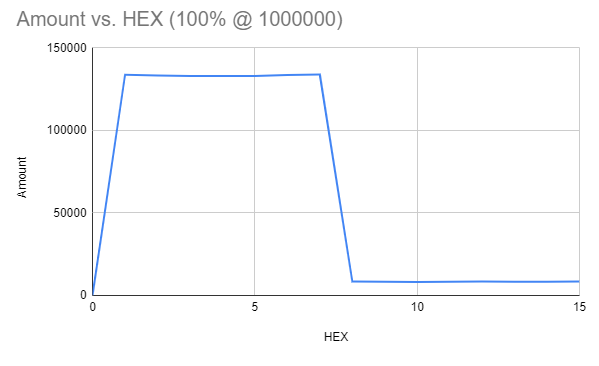

---
title: Improving the Current C++ UUID Generator
author: Brandon Froberg
date: 7 Nov 21
geometry: margin=1in
...

Problem
=======
It took 2.77 hours to generate 1 MILLION Unique UUIDs due to the RNG & algorithm.

Options 1 & 2 
=============  
The first is 1dynamic allocation of used byte range, and #2 is static... which is added as the X.1 comments

Description of Implementation
-----------------------------
1. Simply carve OUT the space needed for the uuid range.[1]
 1. OR use/reserve the LAST 16 BYTES; being 4-12 to ensure FULL 64 bit indexing...
2. RANDOMIZE (as it currently does) the Non-needed characters
 1. It would be 8-4-4 if 1.1 is used; else it's dynamically calculated 
3. Create a string, jam the n+1 looping/incrementing lower half
4. Jam the two components together
5. NO REAL verification of uniqiness is needed, BECAUSE the reserved portion is the indexing/primary key

Note 1
-------
Given UUID's are: 8-4-4-4-12 for a total of 36 characters -- 32 hexadecimal characters and 4 hyphens (wikipedia)
12 - F's ==  281,474,976,710,655 (or 12*4 = 48; 2^48)

```
Byte	Bit	Int
1	4	16
2	8	256
3	12	4096
4	16	65536
5	20	1048576
6	24	16777216
7	28	268435456
8	32	4294967296
9	36	68719476736
10	40	1099511627776
11	44	17592186044416
12	48	281474976710656
13	52	4.5036E+15
14	56	7.20576E+16
15	60	1.15292E+18
16	64	1.84467E+19
```

Option 3
========
Threaded out breakup the current "try and check" method

Description of Implementation
-----------------------------
1. Leverage included `tempThreader.cpp` source
2. Modify the functions to deal with the UUID generation vs. primes
3. Thread out the generation, return the result to the calling node
4. For each returning node: evaluate if it's in the array
 1. Try to see if leaving the string shuffle has any REAL performance impacts
5. Keep threading out the generation until the FULL range is found

Note
----
The current implementation RARELY gets `0,8,9,a,b,c,e,d,f` ... Thus, the top byte's MSB could potentially be leveraged (like a signed value) to help make a pseudo random generator that could ALSO be leveraged in the divide and conquer with the UUID generation..

{width=80%}





